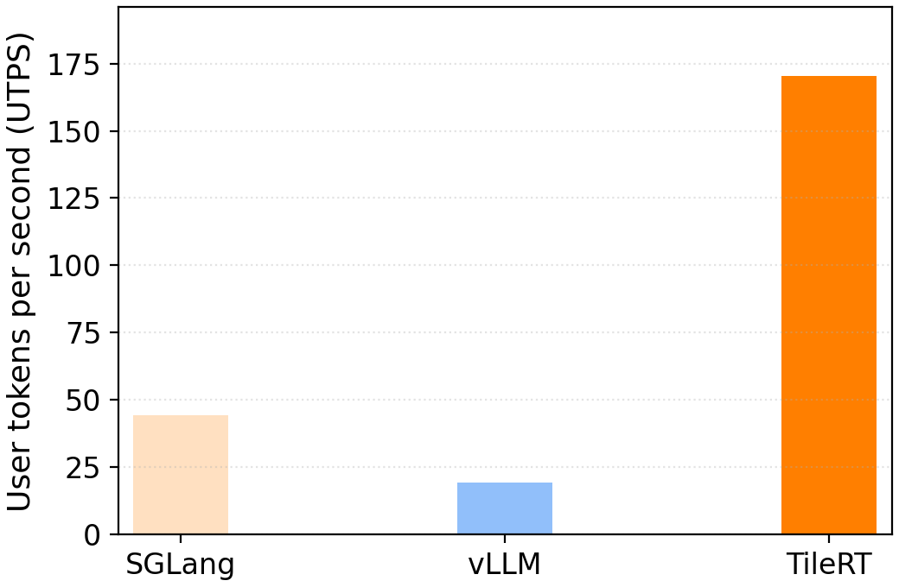

<div align="center">
  
  <h1>TileRT: Tile-Based Runtime for<br>Ultra-Low-Latency LLM Inference</h1>
  <p>
    <a href="https://pypi.org/project/tilert/"></a>
    <a href="https://huggingface.co/Tile-AI/DeepSeek-V3.2-Exp-TileRT"></a>
  </p>
  <p>
    <a href="#python-package-installation"><b>Installation</b></a> |
    <a href="#getting-started"><b>Getting Started</b></a>
  </p>
</div>

TileRT is an experimental project that explores core compiler techniques designed to serve large language models in ultra-low-latency scenarios. Unlike existing inference systems built for high-throughput batch processing, TileRT focuses on delivering extreme responsiveness—critical for applications such as high-frequency trading, interactive AI, real-time decision-making, long-running agents, and AI coding, where users care more about the latency of a few requests or even a single request.

The goal of the TileRT project is to push the latency boundaries of LLMs without compromising model size or quality—for example, enabling models with hundreds of billions of parameters to run at millisecond-level TPOT.

<p align="center">
<br>
Fig. Sequence generation using SGLang (left), vLLM (middle), and TileRT (right) with the DeepSeek-V3.2-Exp model.
</p>

TileRT addresses these challenges with a new tile-level runtime engine. It uses a compiler-driven approach to decompose LLM operators into fine-grained tile-level tasks, and a tile-level runtime that reschedules compute, I/O, and communication across multiple devices in a highly overlapped manner. This allows TileRT to minimize idle time and maximize hardware utilization. These compiler techniques will be incorporated into TileLang and TileScale.

We evaluated TileRT’s preliminary performance using the DeepSeek-V3.2-Exp model (without lossy optimizations such as quantization or distillation) with a batch size of 1 on 8× NVIDIA B200 GPUs. As shown in the benchmark below, TileRT significantly outperforms existing inference systems:

<p align="center">
<br>
Fig. Evaluation setup: batch size: 1, input seqlen/output seqlen: 1K/1K, SGLang-0.5.5, vLLM-0.11.0, CUDA-12.9
</p>

TileRT is a continuously evolving project. Our ongoing plans include pursuing more aggressive optimizations, supporting various batch sizes, more model families and more hardware, and establishing a new foundation for low-latency AI inference. Stay tuned for updates!

- [Installation](#installation)
  - [Prerequisites](#prerequisites)
    - [**Hardware**](#hardware)
    - [**Operating System**](#operating-system)
    - [**Python**](#python)
    - [**PyTorch Build**](#pytorch-build)
  - [Python Package Installation](#python-package-installation)
    - [Docker Installation](#docker-installation)
- [Getting Started](#getting-started)
  - [Download Pre-Converted Weights from HuggingFace](#download-pre-converted-weights-from-huggingface)
    - [Option 1: Using `huggingface-cli` (recommended)](#option-1-using-huggingface-cli-recommended)
    - [Option 2: Using Git + Git LFS](#option-2-using-git--git-lfs)
  - [Running the Generation Example](#running-the-generation-example)
- [Status & Future Work](#status--future-work)

## Installation

### Prerequisites

Before installing the TileRT wheel package, please ensure your environment meets the following requirements:

#### **Hardware**

- 8 NVIDIA B200 GPUs

#### **Operating System**

- Linux x86_64 (Ubuntu 20.04 or later recommended)

#### **Python**

- Python 3.11 – 3.12
  *(The wheel is built and tested against these versions.)*

#### **PyTorch Build**

- PyTorch wheels compiled for CUDA 12.8 or 12.9 (matching the driver/runtime above for B200)

### Python Package Installation

> \[!IMPORTANT\]
> ***Disclaimer***: TileRT is an experimental project. The current preview build supports the 8-GPU B200 setup. For the most reliable experience, we strongly recommend installing the package within the provided Docker image.

#### Docker Installation

To get started, pull the Docker image:

```bash
docker pull tileai/tilert:v0.1.0
```

Then, launch a Docker container using the following command:

```bash
IMAGE_NAME="tileai/tilert:v0.1.0"
WORKSPACE_PATH="xxx"  # Path to the workspace you want to mount

docker run --gpus all -it \
    -v $WORKSPACE_PATH:/workspace/ \
    $IMAGE_NAME
```

After the container starts, install the TileRT package:

```bash
pip install tilert
```

## Getting Started

### Download Pre-Converted Weights from HuggingFace

TileRT requires preprocessing of the original DeepSeek-V3.2-Exp model weights before they can be used for ultra-low-latency inference.
To simplify this process, we provide **pre-converted weights** directly on HuggingFace so users do not need to run the preprocessing pipeline themselves.

You can download the weights using one of the recommended methods below:

#### Option 1: Using `huggingface-cli` (recommended)

```bash
hf download Tile-AI/DeepSeek-V3.2-Exp-TileRT --local-dir ./tilert_weights
```

This will download all files into the `./tilert_weights` directory.

#### Option 2: Using Git + Git LFS

```bash
git lfs install
git clone https://huggingface.co/Tile-AI/DeepSeek-V3.2-Exp-TileRT
```

For additional download methods or advanced usage, please refer to the official Hugging Face documentation.

After downloading the weights, point TileRT to the directory using:

```bash
export MODEL_WEIGHTS_DIR=/path/to/tilert_weights
```

### Running the Generation Example

After downloading the model weights, you can run the generation example within the Docker environment as follows:

```bash
MODEL_WEIGHTS_DIR="/path/to/tilert_weights"

docker run --gpus all -it \
    -v $WORKSPACE_PATH:/workspace/ \
    -v $MODEL_WEIGHTS_DIR:$MODEL_WEIGHTS_MOUNT \
    tilert:v0.1.0
```

Once inside the container, you can run the following Python script:

```python
import torch  # TileRT requires PyTorch runtime to be loaded first
from tilert.generate import ShowHandsGenerator

# Initialize the generator with desired settings
generator = ShowHandsGenerator(
    max_new_tokens=4000,
    temperature=0.0,
    model_weights_dir="xxx",  # Specify your model weights directory here
)

# Load pre-trained weights
generator.from_pretrained()

# Example prompt to test the model's generation abilities
prompt = """Tell me three jokes:

1. A dad joke,
2. A programmer joke,
3. A joke that only makes sense if you've ever tried to train a large language model.
Keep each joke under 15 words.
"""
print("Prompt:", prompt)
print("Completion:")
completion = generator.generate(prompt)
```

For instance, using the above prompt, TileRT might generate:

```text
1. I'm afraid for the calendar. Its days are numbered.
2. There are 10 types of people: those who understand binary and those who don't.
3. My model just generated a coherent sentence. I think I'll go lie down.
```

This example gives you a quick idea of the type of output you can expect from the precompiled model.

For more details, please refer to the [generation script](https://github.com/tile-ai/TileRT/blob/main/tilert/generate.py).

## Status & Future Work

TileRT is currently offered as a preview release, and we’re just getting started.
We are continuously improving the installation experience and enhancing end-to-end performance. Future releases will keep pushing the boundaries of low-latency generation.

Thank you for your interest and support — stay tuned, even faster token generation is on the way!
